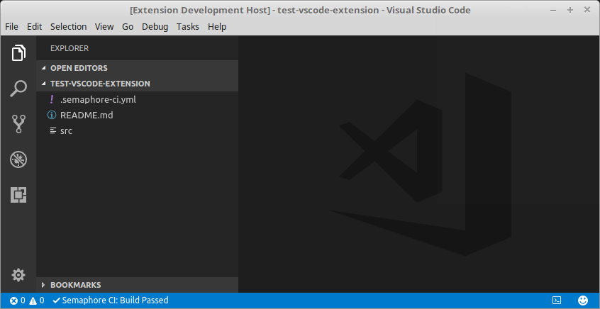

# Semaphore CI Status

The extension allows you to view the build status of your project on [Semaphore CI](https://semaphoreci.com) from within Visual Studio Code.

## Features

At this moment the extension allows you to preview the build status of the specific project branch that you want to observe (as specified in the configuration file described below). In this first version the extension allows only for a single project and single branch monitor. 



## Usage

Once installed, the build status of your specific project branch will be displayed at the Visual Studio Code status bar. In order to be enable the extension to communicate with the Semaphore CI, you need to have ```.semaphore-ci.yml``` file in the root of your Visual Studio Code workspace. In this file you specify the following:

```yml
authToken: semaphore-auth-token
project: project-hash-id
branch: branch-name
```

### Commands

The extension contributes the following commands to your Visual Studio Code:

* **SemaphoreCI: Update Status**: Manually refresh the build status of the specified branch.
* **SemaphoreCI: View Branch in Semaphore**: Open the specified branch in the Semaphore CI web page.

### Settings

The extension contributes the following settings parameters to your Visual Studio Code:

* **semaphoreci.pollInterval**: Interval (in minutes) for refreshing the build status.

E.g. every five minutes:

```sh
"semaphoreci.pollInterval": 5
```

The default value is 0 (zero), which means no automatic refresh.

## Contribution

In case you run into any issues while using the extension or have a suggestion on how to improve it, please [create an issue here](https://github.com/ksokolovic/semaphore-ci-status/issues).

## License

Distributed under the [MIT License](LICENSE).